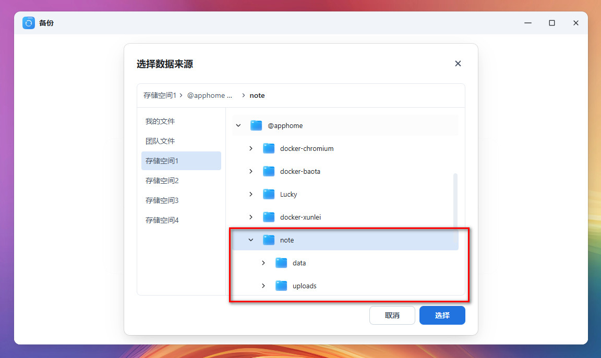
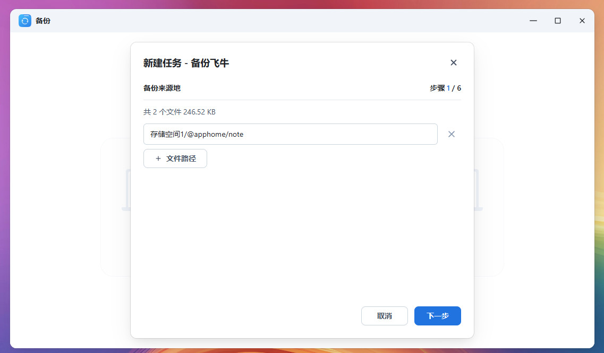
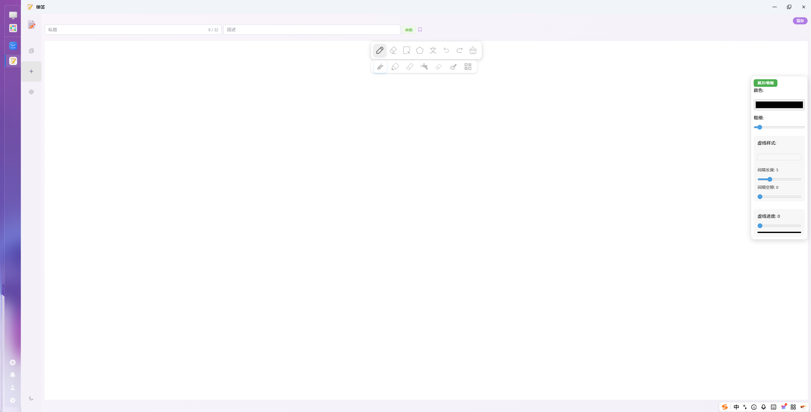
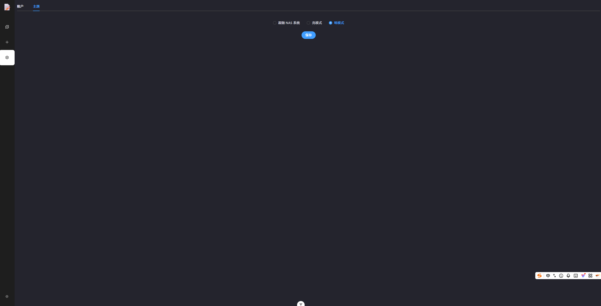
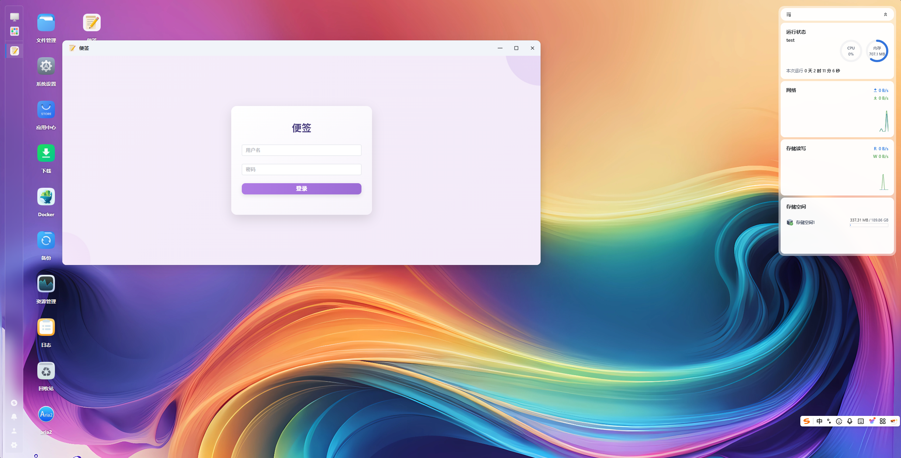
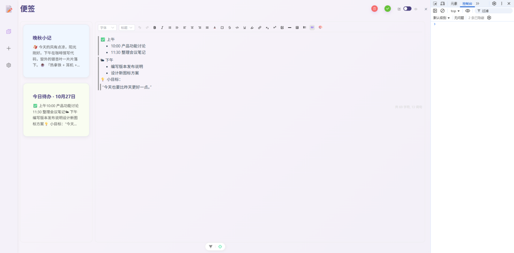
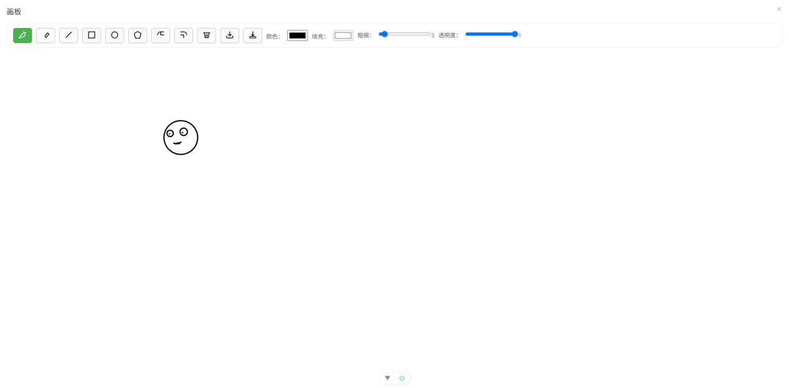

# App.Bin.note

应用包名：note

显示名称：便签

版本：1.0.5

发布者：左平

占用端口： 10030

前端开发：Vue3 + Element-Plus

后端开发：Go + Gin

数据库： Sqlite

浏览器：推荐最新版谷歌浏览器或把浏览器升级到最新版本运行

## 应用说明

一款简洁好用的便签应用，自适应网页，支持 PC 、平板、移动端放访问。 <br/>
应用支持多账号登录，每个账号都能有自己的数据空间。<br/>
支持多类型的便签，<br/>
&nbsp;1.常规便签：<br/>
    &nbsp;&nbsp;&nbsp;&nbsp;可以输入各样式的文字、表格、图片上传、涂鸦、简单Markdown<br/>
&nbsp;2.绘图便签：<br/>
    &nbsp;&nbsp;&nbsp;&nbsp;一个简单的绘画板<br/>
&nbsp;3.思维导图便签：<br/>
    &nbsp;&nbsp;&nbsp;&nbsp;开发中...<br/>
&nbsp;4 ...<br/>
它可以帮助你记录生活、工作和灵感。<br/>
便签功能持续迭代中，欢迎来飞牛论坛给我建议反馈。<br/>
默认账号：<b>admin</b> 密码：<b>123456</b>

## 应用状态
> 迭代中

> 下一版支持功能：（构想）

> 便签思维导图类型、拍照类型、录音类型、附件类型、位置类型、密码本类型

> 拍照、录音类型会上安卓app支持

> 密码类型需要开打密码，内容加密

> 位置类型使用安卓app后台定时实时记录gps位置，并绘制轨迹，这个就当一个儿童手表的位置记录功能吧。

## 本地构建

> 请提前安装好 fnpack

```bash
fnpack build
```

## 安装
### 1. 命令安装
```bash
sudo appcenter-cli uninstall note
sudo appcenter-cli install-fpk note.fpk
sudo appcenter-cli start note
```
### 2. 应用中心安装
<br/>

## CGI 打开方式
> /cgi/ThirdParty/note/index.cgi
#### 如果需要单独打开，你的 NAS 访问地址 + CGI 打开方式。需要先登录 NAS<br/>比如：http://192.168.31.111:5666/cgi/ThirdParty/note/index.cgi

## 便签数据备份
> #### 1. 使用飞牛 备份 应用备份，打开备份->备份飞牛->选择目录（应用安装的存储空间->@apphome/note）->下一步->选择备份目的地... 
> #### 2. note 目录下的两个文件夹 data 和 uploads 分别是 SQLite 数据库文件夹 和 上传文件文件夹

<br/>
<br/>

## [更新日志]<br/>
## 2025-12-26
### 1.0.5<br/>
1.增加搜索功能<br/>
2.增加标签功能，在添加中选择了标签后标签列表右上角有显示<br/>
3.增大标题输入字数<br/>
4.修上传复重复的图片地址错误问题<br/>
5.增加画板便签类型（初版）<br/>
6.首页增加删除功能<br/>

<br/>
<br/>
<br/>
## 2025-12-2
### 1.0.2<br/>
1.新增暗模式<br/>
2.修复一些问题和优化了一些体验<br/>
<br/>
<br/>

---
## 2025-11-28
### 1.0.1<br/>
1.修复刷新页面菜单选中错误问题<br/>
2.修复刷新页面乱跳转问题<br/>
3.优化移动端菜单显示效果，移动端左侧菜单自动收缩展开<br/>
4.去除了每一页的重复标题显示
5.编辑器支持了简单的 Markdown 输入和粘贴自动解析<br/>
6.增加了分页支持，超出 20 条记录自动展示分页栏<br/>
7.内容详情优化了删除、保存、预览/编辑按钮的展示效果<br/>
8.编辑器输入框支持了自适应高度，加入了渐变以示区别<br/>
9.支持了空标题和空内容保存，编辑内容取消最大内容限制<br/>
10.其他优化<br/>

---
## 2025-11-19
### 初版更新 1.0.0<br/>
- ### 登录页
1. 多账户登录功能，每个账号数据独立。<br/>
- ### 首页
1. 无内容时首页新增便签。<br/>
2. 展示便签列表内容，每个内容块展示标题和简介。<br/>
3. 便签列表内容点击宽屏右侧展示便签内容，移动端跳转新页面展示单独的详情页。<br/>
4. 详情内容顶上支持编辑和删除，移动端支持关闭返回便签列表页。
- ### 添加页
1. 支持添加标题、标签、描述自动截取、详情内容。<br/>
2. 详情内容编辑器支持简单的文字排版、表格、图片上传和涂鸦等功能。<br/>
3. 保存后跳转到便签列表页。<br/>
- ### 设置页
1. 支持修改默认 admin 密码，和添加其他账号，管理员账号可以修规其他账号的密码。
2. 可以添加账号和退出登录功能。
---

- ### 功能图片
<br/>

<br/>

<br/>

<br/>

<br/>

<br/>

<br/>

<br/>

<br/>

<br/>

<br/>

## CGI转发代码
### index.cgi 构建：go build -trimpath -o index.cgi cgi.go
```go
package main

import (
	"bytes"
	"fmt"
	"io"
	"mime"
	"net/http"
	"os"
	"path/filepath"
	"strings"
)

const backendURL = "http://127.0.0.1:10030" // 后端接口地址
const debugMode = false                     // true = 开启调试

func main() {
	cwd, _ := os.Getwd()
	path := os.Getenv("REQUEST_URI")

	// Debug 调试模式
	if debugMode {
		debugOutput("路径调试", map[string]string{
			"REQUEST_URI": path,
		})
		return
	}

	// 1. 规范化路径
	path = normalizePath(path)

	// 2. API 请求优先
	if isAPIRequest(path) {
		proxyToBackend(path)
		return
	}

	// 3. 静态文件服务
	if serveStaticFile(cwd, path) {
		return
	}

	// 4. fallback index.html
	serveIndexHTML(cwd)
}

/* ================================
 * 路径处理
 * ================================
 */
// 规范化路径
func normalizePath(path string) string {
	if path == "" {
		return "/index.html"
	}

	// 提取 index.cgi 后面的路径
	if strings.Contains(path, "index.cgi/") {
		return "/" + strings.SplitN(path, "index.cgi/", 2)[1]
	}

	// 访问 index.cgi 本体 → 返回首页
	if strings.HasSuffix(path, "index.cgi") {
		return "/index.html"
	}

	return path
}

/* ================================
 * 静态文件服务
 * ================================
 */
func serveStaticFile(cwd, path string) bool {
	var filePath string

	// uploads 特殊存储
	if strings.HasPrefix(path, "/uploads/") {
		filePath = filepath.Join(cwd, "../../../@apphome/note/", path)
	} else {
		filePath = filepath.Join(cwd, path)
	}

	if _, err := os.Stat(filePath); err != nil {
		return false
	}

	file, err := os.Open(filePath)
	if err != nil {
		outputError(404, err)
		return true
	}
	defer file.Close()

	contentType := getContentType(filePath)
	fmt.Println("Status: 200 OK")
	fmt.Printf("Content-Type: %s\r\n\r\n", contentType)
	io.Copy(os.Stdout, file)
	return true
}

// fallback index.html
func serveIndexHTML(cwd string) {
	filePath := filepath.Join(cwd, "index.html")
	file, err := os.Open(filePath)
	if err != nil {
		outputError(404, err)
		return
	}
	defer file.Close()

	fmt.Println("Status: 200 OK")
	fmt.Println("Content-Type: text/html\r\n")
	io.Copy(os.Stdout, file)
}

/* ================================
 * 判断是否是 API 请求
 * ================================
 */
func isAPIRequest(path string) bool {
	return strings.HasPrefix(path, "/admin/") ||
		strings.HasPrefix(path, "/app/")
}

/* ================================
 * Content-Type 管理
 * ================================
 */
// getContentType 自动识别文件类型
func getContentType(filePath string) string {
	ext := strings.ToLower(filepath.Ext(filePath))
	if ext == "" {
		return "application/octet-stream"
	}

	// 尝试通过系统 MIME 表识别
	mimeType := mime.TypeByExtension(ext)
	if mimeType != "" {
		return mimeType
	}

	// 默认二进制流
	return "application/octet-stream"
}

/* ================================
 * 后端代理
 * ================================
 */
func proxyToBackend(path string) {
	method := os.Getenv("REQUEST_METHOD")
	if method == "" {
		method = "GET"
	}

	var body []byte
	if method != "GET" && method != "HEAD" {
		body, _ = io.ReadAll(os.Stdin)
	}

	targetURL := backendURL + path
	req, err := http.NewRequest(method, targetURL, bytes.NewReader(body))
	if err != nil {
		outputError(500, err)
		return
	}

	copyHeaders(req)

	client := &http.Client{}
	resp, err := client.Do(req)
	if err != nil {
		outputError(502, err)
		return
	}
	defer resp.Body.Close()

	fmt.Printf("Status: %d OK\r\n", resp.StatusCode)
	for k, vs := range resp.Header {
		fmt.Printf("%s: %s\n", k, strings.Join(vs, ","))
	}
	fmt.Println()

	io.Copy(os.Stdout, resp.Body)
}

// 复制 CGI 的请求头
func copyHeaders(req *http.Request) {
	for _, env := range os.Environ() {
		if strings.HasPrefix(env, "HTTP_") {
			parts := strings.SplitN(env, "=", 2)
			key := strings.ReplaceAll(parts[0][5:], "_", "-")
			req.Header.Set(key, parts[1])
		}
	}

	if ip := os.Getenv("X-Real-IP"); ip != "" {
		req.Header.Set("X-Real-IP", ip)
		req.Header.Set("X-Forwarded-For", ip)
	}
}

/* ================================
 * 工具方法
 * ================================
 */
// 错误输出
func outputError(code int, err error) {
	fmt.Printf("Status: %d Error\r\n", code)
	fmt.Println("Content-Type: text/plain\r\n")
	fmt.Println("CGI Error:")
	fmt.Println(err)
}

// Debug 输出
func debugOutput(title string, items map[string]string) {
	fmt.Println("Status: 200 OK")
	fmt.Println("Content-Type: text/plain; charset=utf-8\r\n")

	fmt.Println("====== DEBUG MODE ======")
	fmt.Println("INFO:", title)
	fmt.Println("-------------------------")

	for k, v := range items {
		fmt.Printf("%s: %s\n", k, v)
	}

	if os.Getenv("REQUEST_METHOD") != "GET" {
		body, _ := io.ReadAll(os.Stdin)
		fmt.Println("\n====== BODY ======")
		fmt.Println(string(body))
	}

	fmt.Println("\n====== ENV ======")
	for _, env := range os.Environ() {
		fmt.Println(env)
	}

	fmt.Println("\n====== END ======")
}

```
