# App.Bin.note

> 应用包名：note <br/>
> 显示名称：便签 <br/>
> 版本：1.0.8 <br/>
> 发布者：左平 <br/>
> 占用端口： 10030 <br/>
> 前端开发：Vue3 + Element-Plus <br/>
> 后端开发：Go + Gin <br/>
> 移动端：UniApp <br/>
> 数据库： Sqlite <br/>
> 浏览器：推荐最新版谷歌浏览器或把浏览器升级到最新版本运行

## 应用说明

> 一款简洁好用的便签应用，自适应网页，支持 PC 、平板、移动端放访问。 <br/>
应用支持多账号登录，每个账号都能有自己的数据空间。<br/>
支持多类型的便签，<br/>
&nbsp;1.常规便签：<br/>
    &nbsp;&nbsp;&nbsp;&nbsp;可以输入各样式的文字、表格、图片上传、涂鸦、简单Markdown<br/>
&nbsp;2.绘图便签：<br/>
    &nbsp;&nbsp;&nbsp;&nbsp;一个简单的绘画板<br/>
&nbsp;3.思维导图便签：<br/>
    &nbsp;&nbsp;&nbsp;&nbsp;嵌入那款最火的思维导图开源组件到系统中<br/>
&nbsp;4.拍照类型：<br/>
    &nbsp;&nbsp;&nbsp;&nbsp;可以把你拍照中最稀罕的几张图片保存到这里,轮播播放、列表、多宫格展示<br/>
&nbsp;5.录音类型：<br/>
&nbsp;&nbsp;&nbsp;&nbsp;可以把你的需要单独保存的录音保存到这里，支持播放和可视化<br/>
&nbsp;6.位置类型：<br/>
&nbsp;&nbsp;&nbsp;&nbsp;使用腾讯地图绘制记录你的位置轨迹<br/>
&nbsp;7.密码本类型：<br/>
&nbsp;&nbsp;&nbsp;&nbsp;使用 AES-256-GCM 算法加密你的密码本内容，支持多个平台的账号保存<br/>
它可以帮助你记录生活、工作和灵感。<br/>
便签功能持续迭代中，欢迎来飞牛论坛给我建议反馈。<br/>
默认账号：<b>admin</b> 密码：<b>123456</b>

## 应用状态
> 迭代中

> 待开发功能：

> 导入、导出功能

> uniapp 版本 小程序、APP客户端开发 

## 本地构建

> 请提前安装好 fnpack

```bash
sudo fnpack build && sudo appcenter-cli install-local note.fpk
```

## 飞牛论坛交流帖
> https://club.fnnas.com/forum.php?mod=viewthread&tid=45704

## 安装
> 先下载 note.fpk 文件，然后在应用中心手动安装 <br/><br/>
> <br/>

## 新窗口打开方式
> 如果需要单独打开，你的 NAS 访问地址 + /cgi/ThirdParty/note/index.cgi 打开。<br/>
> 需要先登录 NAS<br/>比如：http://192.168.31.111:5666/cgi/ThirdParty/note/index.cgi

## 便签数据备份
> 1. 使用飞牛 备份 应用备份，打开备份->备份飞牛->选择目录（应用安装的存储空间->@apphome/note）->下一步->选择备份目的地... 
> 2. note 目录下的三个文件夹 data 、uploads、backup 分别是 SQLite 数据库文件夹、上传文件文件夹和系统备份目录<br/><br/>
> 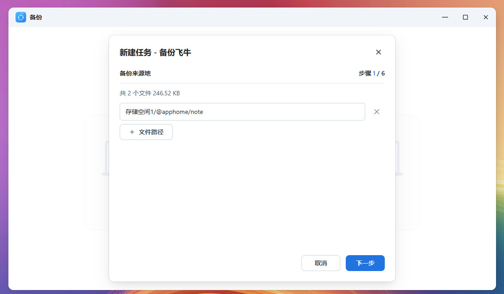<br/>

### 功能图片
> 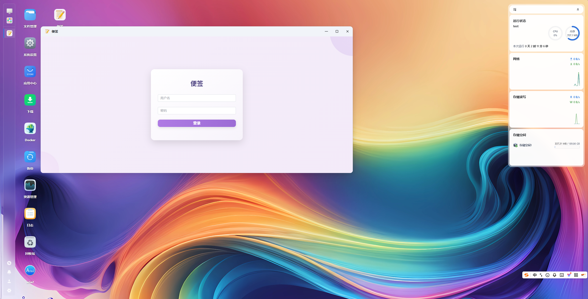<br/>
> <br/>
> 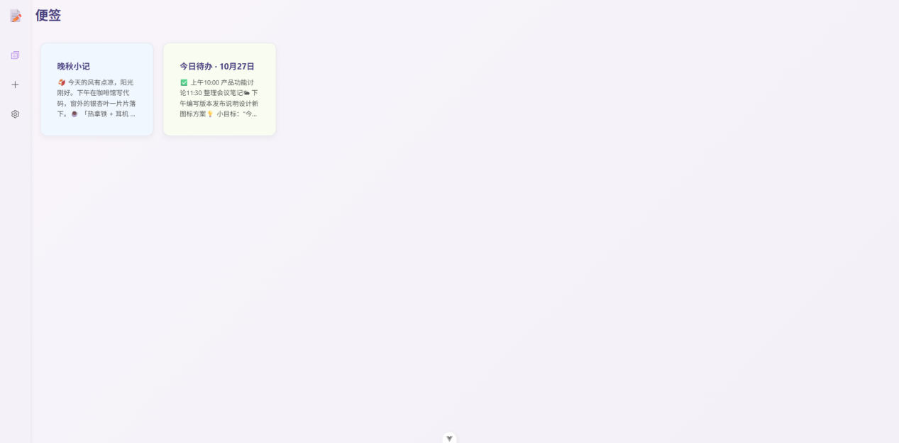<br/>
> 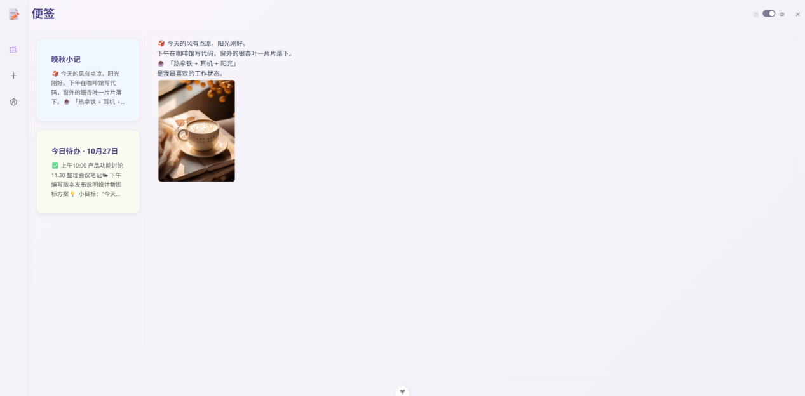<br/>
> 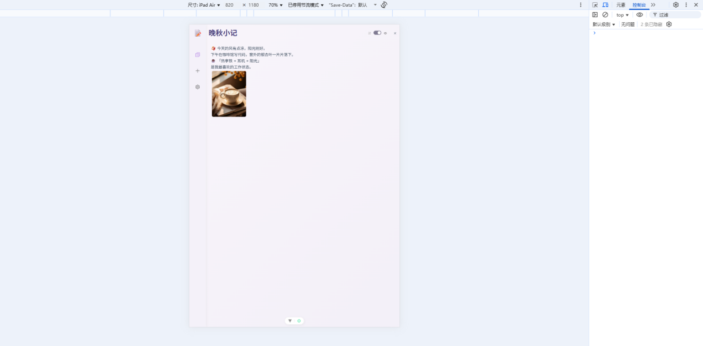<br/>
> 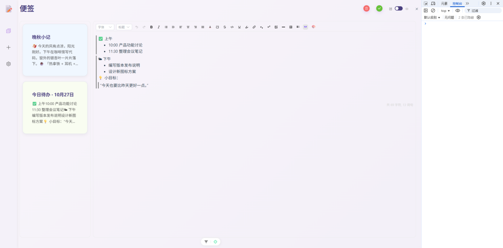<br/>
> 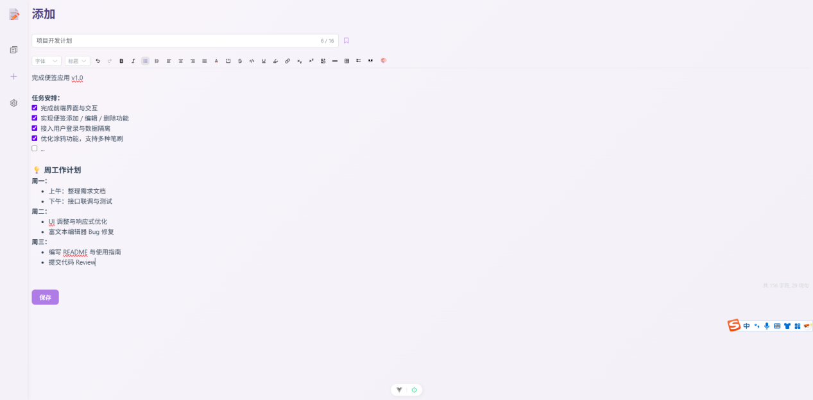<br/>
> 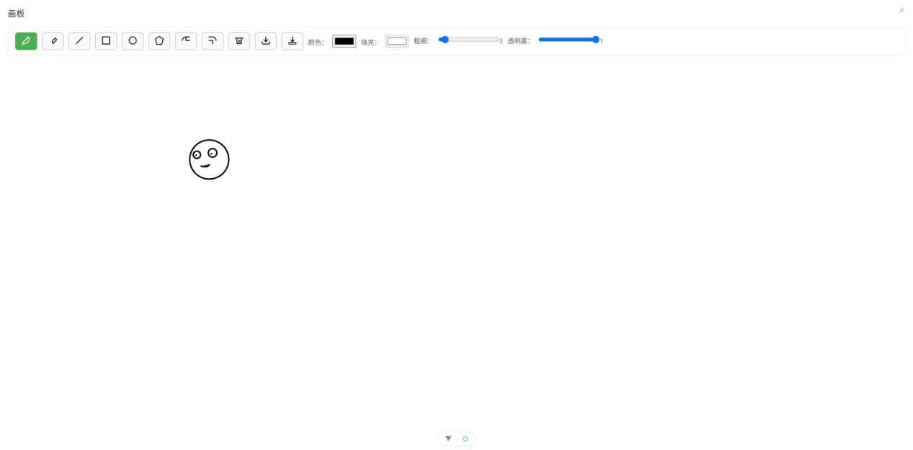<br/>
> 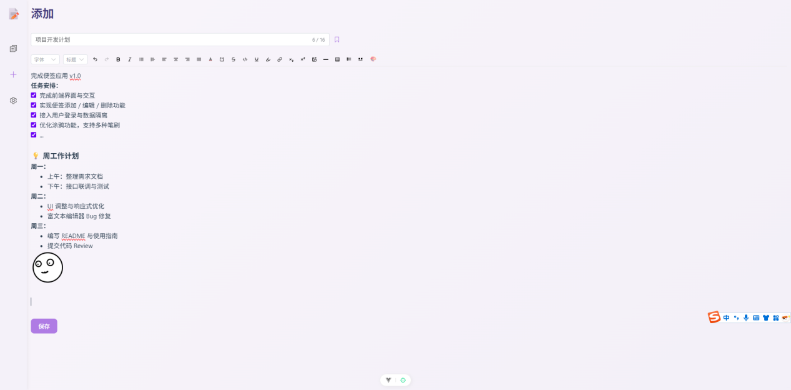<br/>
> 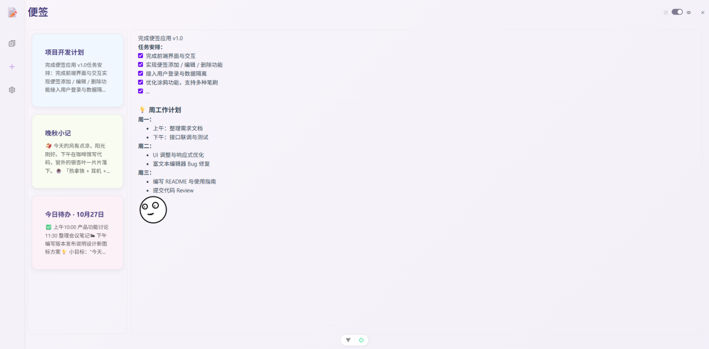<br/>
> 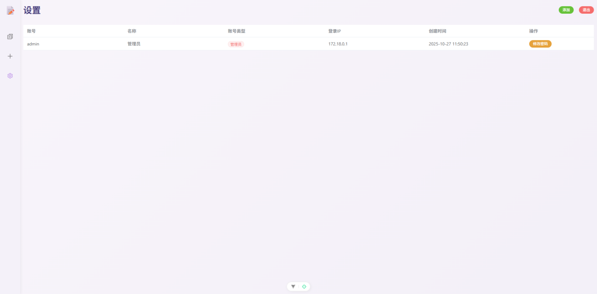<br/>
