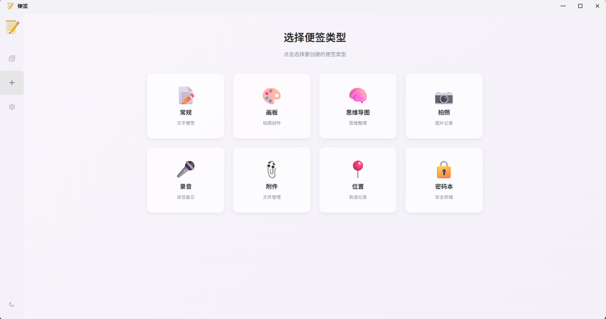
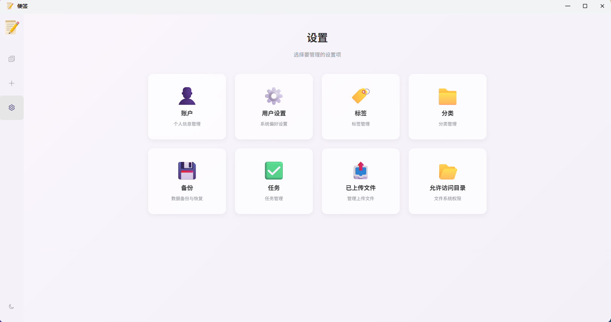

# App.Bin.note

> 应用包名：note  
> 显示名称：便签  
> 版本：1.1.0  
> 发布者：左平  
> 占用端口： 10030 （内部） 10029 （外部）  
> 前端开发：Vue3 + Element-Plus  
> 后端开发：Go + Gin  
> 移动端：UniApp  
> 数据库： Sqlite  
> 浏览器：推荐最新版谷歌浏览器或把浏览器升级到最新版本运行

## 应用说明

> 一款好用的便签应用。自适应网页，支持导入导出（markdown、html、png、pdf），历史记录查看，可从 NAS 添加文件，支持 HTTPS，可从外部 10029 端口访问，可多用户登录，数据备份恢复，文件管理，功能丰富。 
支持多类型的便签， 
&nbsp;1.常规便签： 
    &nbsp;&nbsp;&nbsp;&nbsp;可以输入各样式的文字、表格、图片上传、涂鸦、简单Markdown 
&nbsp;2.绘图便签： 
    &nbsp;&nbsp;&nbsp;&nbsp;一个简单的绘画板 
&nbsp;3.思维导图便签： 
    &nbsp;&nbsp;&nbsp;&nbsp;嵌入那款最火的思维导图开源组件到系统中 
&nbsp;4.拍照类型： 
    &nbsp;&nbsp;&nbsp;&nbsp;可以把你拍照中最喜欢的几张图片保存到这里,轮播播放、列表、多宫格展示 
&nbsp;5.录音类型： 
&nbsp;&nbsp;&nbsp;&nbsp;可以把你的需要单独保存的录音保存到这里，支持播放和可视化 
&nbsp;6.附件类型便签： 
&nbsp;&nbsp;&nbsp;&nbsp;一些特别的附件文件保存到这里 
&nbsp;7.位置类型： 
&nbsp;&nbsp;&nbsp;&nbsp;使用腾讯地图绘制记录你的位置轨迹 
&nbsp;8.密码本类型： 
&nbsp;&nbsp;&nbsp;&nbsp;使用 AES-256-GCM 算法加密你的密码本内容，支持多个平台的账号保存 
默认账号：<b>admin</b> 密码：<b>123456</b>

## 应用状态
> uniapp 版本 小程序、APP客户端开发中 

## 支持我
>  
> 请支持我，继续开发更多功能。

## 飞牛论坛交流帖
> https://club.fnnas.com/forum.php?mod=viewthread&tid=45704

## 安装
> 先下载 note.fpk 文件，然后在应用中心手动安装   
>  

## 外部访问
> 不通过飞牛 APP 的方式访问便签，只支持 HTTPS 访问，自带自签证书，外部端口 10029，可以用路由器把 10029 端口映射出来，也可以通过反向代理到你的 NAS 地址和 10029 端口访问。

## 便签数据备份
> 1. 使用飞牛 备份 应用备份，打开备份->备份飞牛->选择目录（应用安装的存储空间->@apphome/note）->下一步->选择备份目的地... 
> 2. note 目录下的三个文件夹 data 、uploads、backup 分别是 SQLite 数据库文件夹、上传文件文件夹和系统备份目录  
>  

### 功能图片
>  
>  
>  
>  
>  
>  
>  
